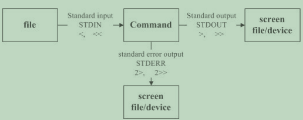

### 1、认识与学习BASH

#### Bash shell的功能

- 命令记忆能力 （history）
- 命令与文件补全功能： （[tab] 按键的好处）
- 命令别名设置功能： （alias lm='ls -al'）
- 工作控制、前景背景控制
- 程序化脚本： （shell scripts）
- 通配符

#### 变量的取用：echo

```
[dmtsai@study ~]$ echo $variable 
[dmtsai@study ~]$ echo $PATH /usr/local/bin:/usr/bin:/usr/local/sbin:/usr/sbin:/home/dmtsai/.local/bin:/home/dmtsai/bin
[dmtsai@study ~]$ echo ${PATH} # 近年来，鸟哥比较偏向使用这种格式喔！
```

#### 变量的设置规则：

1. 变量与变量内容以一个等号“=”来链接，如下所示： “myname=VBird”
2. 等号两边不能直接接空白字符，如下所示为错误： “myname = VBird”或“myname=VBird Tsai”
3. 变量名称只能是英文字母与数字，但是开头字符不能是数字，如下为错误： “2myname=VBird”
4. 变量内容若有空白字符可使用双引号“"”或单引号“'”将变量内容结 合起来，但双引号内的特殊字符如 $ 等，可以保有原本的特性，如下所示： “var="lang is $LANG"”则“echo $var”可得“lang is zh_TW.UTF-8”单引号内的特殊字符则仅为一般字符 （纯文本），如下所示： “var='lang is $LANG'”则“echo $var”可得“lang is $LANG”

5. 可用跳脱字符“ \ ”将特殊符号（如 [Enter], $, \, 空白字符, '等）变成 一般字符如：“myname=VBird\ Tsai”
6. 在一串指令的执行中，还需要借由其他额外的指令所提供的信息 时，可以使用反单引号“`指令`”或 “$（指令）”。特别注意，那个 ` 是键盘上方的数字键 1 左边那个按键，而不是单引号！ 例如想要取得核心版本的设置： “version=$（uname -r）”再“echo $version”可得“3.10.0229.el7.x86_64”
7. 若该变量为扩增变量内容时，则可用 "$变量名称" 或 ${变量} 累加内容，如下所示：“PATH="$PATH":/home/bin”或“PATH=${PATH}:/home/bin”
8. 若该变量需要在其他子程序执行，则需要以 export 来使变量变成环
境变量： “export PATH”
9. 通常大写字符为系统默认变量，自行设置变量可以使用小写字符， 方便判断 （纯粹依照使用者兴趣与嗜好） ；
10. 取消变量的方法为使用 **unset** ：“unset 变量名称”例如取消 myname 的设置： “unset myname”

#### 反单引号``

- 在一串指令中，在 \` `之内的指令将会被先执行，而其执行出来的结果将做为外部的输入信息！

#### 数组类型

- var[index]=content

  ```bash
  [dmtsai@study ~]$ var[1]="small min" 
  [dmtsai@study ~]$ var[2]="big min" 
  [dmtsai@study ~]$ var[3]="nice min" 
  [dmtsai@study ~]$ echo "${var[1]}, ${var[2]}, ${var[3]}" small min, big min, nice min
  ```

#### 变量内容的删除、取代与替换

| 变量设置方式                                       | 说明                                                         |
| -------------------------------------------------- | ------------------------------------------------------------ |
| ${变量#关键字} <br/>${变量##关键字}                | 若变量内容从头开始的数据符合“关键字”，则将符 合的最短数据删除<br/>若变量内容从头开始的数据符合“关键字”，则将符 合的最长数据删除 |
| ${变量%关键字} <br/>${变量%%关键 字}               | 若变量内容从尾向前的数据符合“关键字”，则将符 合的最短数据删除<br/>若变量内容从尾向前的数据符合“关键字”，则将符 合的最长数据删除 |
| ${变量/旧字串/新 字串}<br/>${变量//旧字串/ 新字串} | 若变量内容符合“旧字串”则“第一个旧字串会被新字 串取代”<br/>若变量内容符合“旧字串”则“全部的旧字串会被新字 串取代” |

#### 变量的测试与内容替换

- 减号“ - ”

```
范例一：测试一下是否存在 username 这个变量，若不存在则给予 username 内容为 root [dmtsai@study ~]$ echo ${username} <==由于出现空白，所以 username 可能不存在，也可能是空字串
[dmtsai@study ~]$ username=${username-root} [dmtsai@study ~]$ echo ${username} root
<==因为 username 没有设置，所以主动给予名为 root 的内容。
[dmtsai@study ~]$ username="vbird tsai" <==主动设置 username 的内容 
[dmtsai@study ~]$ username=${username-root} [dmtsai@study ~]$ echo ${username} vbird tsai <==因为 username 已经设置了，所以使用旧有的设置而不以 root 取代
```

#### 指令运行的顺序

1. 以相对/绝对路径执行指令，例如“ /bin/ls ”或“ ./ls ”； 
2. 由 alias 找到该指令来执行； 
3. 由 bash 内置的 （builtin） 指令来执行； 
4. 通过 $PATH 这个变量的顺序搜寻到的第一个指令来执行。

#### bash 默认 的组合键

| 组合按键 |                执行结果                |
| :------: | :------------------------------------: |
| Ctrl + C |             终止目前的命令             |
| Ctrl + D | 输入结束 （EOF），例如邮件结束的时候； |
| Ctrl + M |            就是 Enter 啦！             |
| Ctrl + S |             暂停屏幕的输出             |
| Ctrl + Q |             恢复屏幕的输出             |
| Ctrl + U |      在提示字符下，将整列命令删除      |
| Ctrl + Z |            “暂停”目前的命令            |

#### 通配符与特殊符号

| 符号 | 意义                                                         |
| ---- | ------------------------------------------------------------ |
| *    | 代表“ 0 个到无穷多个”任意字符                                |
| ?    | 代表“一定有一个”任意字符                                     |
| [ ]  | 同样代表“一定有一个在括号内”的字符（非任意字符）。例如 [abcd] 代表“一定有一个字符， 可能是 a, b, c, d 这四个任何一 个” |
| [ -] | 若有减号在中括号内时，代表“在编码顺序内的所有字符”。例 如 [0-9] 代表 0 到 9 之间的所有数字，因为数字的语系编码是 连续的！ |
| [^ ] | 若中括号内的第一个字符为指数符号 （^） ，那表示“反向选 择”，例如 [^abc] 代表 一定有一个字符，只要是非 a, b, c 的其 他字符就接受的意思。 |

#### 数据流重导向（重要）



- 标准输出：读取 /etc/crontab 后，将该文件内容显示到屏幕上；

- 标准错误输出：因为无法找到 /etc/vbirdsay，因此在屏幕上显示错 误讯息

- 数据流重导向可以将 standard output （简称 stdout） 与 standard error output （简称 stderr） 分别传送到其他 的文件或设备去

  - 标准输入 （stdin） ：代码为 0 ，使用 < 或 << ；
  - 标准输出 （stdout）：代码为 1 ，使用 > 或 >> ；
  - 标准错误输出（stderr）：代码为 2 ，使用 2> 或 2>> ；

- **/dev/null 垃圾桶黑洞设备与特殊写法**

  - 这个 /dev/null 可以吃掉任何导向这个设备的信息喔！

  - ```bash
    [dmtsai@study ~]$ find /home -name .bashrc 2> /dev/null
    ```

- 用 stdin 取代键盘的输入以创建新文件的简单流程

  - [dmtsai@study ~]$ cat > catfile < ~/.bashrc
  - cat > catfile << "eof"   表示：我要用 cat 直接将输 入的讯息输出到 catfile 中， 且当由键盘输入 eof 时，该次输入就结束.

#### 命令执行的判断依据： ; , &&, ||

- 由于指令是一个接着一个去执行的，因此，如果真要使用判断， 那么这个 && 与 || 的顺序就不能搞错
- 一般来说，假设判断式有三个，**command1 && command2 || command3** 顺序通常不会变，因为一般来说， command2 与 command3会放置肯定可以执行成功的指令

#### 常用管道PIPE命令

- **每个管线后面接的第一个数据必定是“指令”喔！而且这个指令必须要能够接受 standard input 的数据才行**
  - 例如 less, more, head, tail 等都是
  - 例如 ls, cp, mv 等就不是管线命令了
- 关于减号 - 的用途
  - tar -cvf - /home | tar -xvf - -C /tmp/homeback
  - 上面这个例子是说：“我将 /home 里面的文件给他打包，但打包的数据不是纪录到文件，而是传送到 stdout； 经过管线后，将 tar -cvf /home 传送给后面的 tar -xvf - ”。后面的这个 - 则是取用前一个指令的 stdout， 因此，我们就不需要使用 filename 了！这是很常见的例子喔！ 注意注意！

| 命令名 | 作用                                                         | 参数                                                         | 示例                                                         |
| ------ | ------------------------------------------------------------ | ------------------------------------------------------------ | ------------------------------------------------------------ |
| less   | 前后翻动相关的信息                                           |                                                              | [dmtsai@study ~]$ ls -al /etc \| less                        |
| cut    | 分割字符                                                     | -d ：后面接分隔字符。与 -f 一起使用； <br/>-f ：依据 -d 的分隔字符将一段讯息分区成为数段，用 -f 取出第几段的意思； <br/>-c ：以字符 （characters） 的单位取出固定字符区间；<br/>我们还可以指定某个范围的值，例如第 12-20 的字符，就是 cut -c 12-20 等等！ | echo ${PATH} \| cut -d ':' -f 5                              |
| grep   | 分析一行讯息， 若当中有我们所需要的信息，就将该行拿出来～    | **grep [-acinv] [--color=auto] '搜寻字串' filename**<br/>-a ：将 binary 文件以 text 文件的方式搜寻数据 <br/>-c ：计算找到 '搜寻字串' 的次数 <br/>-i ：忽略大小写的不同，所以大小写视为相同 <br/>-n ：顺便输出行号<br/> -v ：反向选择，亦即显示出没有 '搜寻字串' 内容的那一行！ <br/>--color=auto ：可以将找到的关键字部分加上颜色的显示喔！ |                                                              |
| sort   | 他可以帮我们进行排序，而且可以依据不同的数据型态来排序喔     | **sort [-fbMnrtuk] [file or stdin]<br/>**-f ：忽略大小写的差异，例如 A 与 a 视为编码相同； <br/>-b ：忽略最前面的空白字符部分； <br/>-M ：以月份的名字来排序，例如 JAN, DEC 等等的排序方法； <br/>-n ：使用“纯数字”进行排序（默认是以文字体态来排序的）； -r ：反向排序； <br/>-u ：就是 uniq ，相同的数据中，仅出现一行代表；<br/> -t ：分隔符号，默认是用 [tab] 键来分隔；<br/> -k ：以那个区间 （field） 来进行排序的意思 |                                                              |
| uniq   | 排序完成了，想要将重复的数据仅列出一个显示                   | **uniq [-ic]**<br/>-i ：忽略大小写字符的不同； <br/>-c ：进行计数 |                                                              |
| wc     | 计数                                                         | **wc [-lwm]**<br/>-l ：仅列出行； <br/>-w ：仅列出多少字（英文单字）； <br/>-m ：多少字符； | cat /etc/man_db.conf    \| wc                                |
| tee    | 双向重导向                                                   | **tee [-a] file**<br/>-a ：以累加 （append） 的方式，将数据加入 file 当中！ | tee 会同时将数据流分送到文件去与屏幕 （screen）；而输出到屏 幕的，其实就是 stdout ，那就可以让下个指令继续处理喔 |
| tr     | 可以用来删除一段讯息当中的文字，或者是进行文字讯息的替 换！  | **tr [-ds] SET1 ...**<br/>-d ：删除讯息当中的 SET1 这个字串；<br/> -s ：取代掉重复的字符！ | last \| tr  '[a-z]'  '[A-Z]'                                 |
| col    | 他可以用来简单的处理将 [tab] 按键取代成为空白键              | **col [-xb]**<br/>-x ：将 tab 键转换成对等的空白键           |                                                              |
| join   | 两个文件当中，有 "相同数据" 的那一行，才将他加在一起         | **join [-ti12] file1 file2**<br/>-t ：join 默认以空白字符分隔数据，并且比对“第一个字段”的数据， 如果两个文件相同，则将两笔数据联成一行，且第一个字段放在第一个！<br/>-i ：忽略大小写的差异； <br/>-1 ：这个是数字的 1 ，代表“第一个文件要用那个字段来分析”的意思； <br/>-2 ：代表“第二个文件要用那个字段来分析”的意思。 |                                                              |
| paste  | 将两行贴在一起，且中间以 [tab] 键隔 开                       | **paste [-d] file1 file2**<br/>-d ：后面可以接分隔字符。默认是以 [tab] 来分隔的！<br/> - ：如果 file 部分写成 - ，表示来自 standard input 的数据的意思。 | paste /etc/passwd /etc/shadow                                |
| expand | 这玩意儿就是在将 [tab] 按键转成空白键啦～                    | **expand [-t] file**<br/>-t ：后面可以接数字。一般来说，一个 tab 按键可以用 8 个空白键取代。 我们也可以自行定义一个 [tab] 按键代表多少个字符呢！ |                                                              |
| xargs  | xargs 可以读入 stdin 的数据，并且以空 白字符或断行字符作为分辨，将 stdin 的数据分隔成为 arguments |                                                              |                                                              |


#### 常用其他命令

|      命令名       | 参数                                                         | 作用                                            | 示例                       |
| :---------------: | :----------------------------------------------------------- | :---------------------------------------------- | :------------------------- |
|       type        | **type [-tpa] name**<br/>：不加任何选项与参数时，type 会显示出 name 是外部指令还是 bash 内置指令<br/>-t ：当加入 -t 参数时，type 会将 name 以下面这些字眼显示出他的意义： file ：表示为外部指令； alias ：表示该指令为命令别名所设置的名称； builtin ：表示该指令为 bash 内置的指令功能；<br/>-p ：如果后面接的 name 为外部指令时，才会显示完整文件名； <br/>-a ：会由 PATH 变量定义的路径中，将所有含 name 的指令都列出来，包含 alias | 查询指令是否为 Bash shell 的内置命令            | type [-tpa] name           |
|     \\[Enter]     |                                                              | 跨行指令                                        |                            |
|       echo        |                                                              | 变量的取用                                      |                            |
|        env        |                                                              | 列出目前的 shell 环境下的所有环境变量与其内容。 |                            |
|        set        |                                                              | 观察所有变量 （含环境变量与自订变量）           |                            |
|      export       |                                                              |                                                 |                            |
|         $         |                                                              | 用$表示关于本 shell 的 PID   例如：echo $$      | echo $$                    |
|         ?         |                                                              | 用?表示关于上个执行指令的回传值   例如：echo $? | echo $?                    |
|       read        | **read [-pt] variable**<br/>-p ：后面可以接提示字符！<br/> -t ：后面可以接等待的“秒数！” |                                                 |                            |
| declare / typeset | **declare [-aixr] variable**<br/>-a ：将后面名为 variable 的变量定义成为阵列 （array） 类型 <br/>-i ：将后面名为 variable 的变量定义成为整数数字 （integer） 类型 <br/>-x ：用法与 export 一样，就是将后面的 variable 变成环境变量； <br/>-r ：将变量设置成为 readonly 类型，该变量不可被更改内容，也不能 unset | 宣告变量的类型                                  |                            |
|      ulimit       |                                                              | 对内存等进行分配                                | ulimit [-SHacdfltu] [配额] |
|  alias, unalias   |                                                              | 命令的别名                                      | alias lm='ls -al \|more'   |

### 2、学习shell script

- shell脚本的好处	

  - 不需要经过编译就可以直接执行
  - 读到一个ENTER就开始执行该行
  - 可以用\ENTER延伸至下一行
  - 使用#作为注释

- 善用判断式

  - test -e /dmtsai

    >文件类型
    >
    >- -e：文件是否存在
    >- -f：文件名是否存在且为文件
    >- -d：文件名是否存在且为目录
    >- -b：文件名是否存在且为blockdevice
    >- -s：文件名是否存在且为一个socket文件
    >- -p：文件名是否存在且为一个pipe文件
    >- -l：文件名是否存在且为一个链接

    >文件权限
    >
    >- -r：读
    >- -w：写
    >- -x：执行

    >文件比较
    >
    >- test file1 -nt file2
    >- -nt：new than
    >- -ot：old than
    >- -ef：equals file，为相同文件

    > 整数比较
    >
    > - -eq：=
    > - -ne：！=
    > - -gt：>
    > - -lt：<
    > - -ge：>=
    > - -lt：<=

    > 判定字符串
    >
    > - -z：是否为空字符串
    > - -n：字符串长度是否为0

    > 多重条件判断
    >
    > - test -r filename1 -a -x filename2
    > - -a：同时成立
    > - -o：or
    > - ！：反相状态

- 利用判断符号

  - [ ... ]  注意括号前后有两个空格
    - 中括号内每个元件都需要空白键来分割
    - 中括号内的变量，最好都以双括号括起来
    - 中括号内的常数，最好以单双括号括起来

- SHELL script的默认变量

  - $0：代表脚本本身
  - $1：代表脚本的第一个参数。。以此类推
  - $@:将所有参数保存，每一个参数都是独立的，类似于存为一个数组
  - $*：代表"$1 $2 $3"，给参数中间加空格
  - shift：参数变量号码偏移

- 条件判断式

  ```bash
  if[ 判断式 ];then
  	指令工作
  elif[ 判断式子 ];then
  	指令工作
  else
  	指令工作
  fi
  ```

  ```bash
  case $变量 in
  	"第一个变量内容")
  		程序
  		;;
  	"第二个变量内容")
  		程序
  		;;
  		        *)
  		程序
  		;;
  esac
  ```

- 函数

  ```bash
  function fname(){
  
  
  }
  注意：函数中的$0与shell中的$0无关
  ```

- 循环

  ```
  while[ condition ]
  do
  	循环体
  done
  ```

  ```
  untile[ conditon ]
  do
  	循环体
  done
  ```

  ```bash
  #第一种
  for var in con1 con2 con3
  do
  	循环体
  done
  #第二种
  for var in `seq 1 100`
  do
  	...
  done
  #第三种
  for var in {1..10}
  do
  	...
  done
  #第四种
  for ((i=1;i<=...;i=i+1))
  do
  	...
  done
  ```

- debug

  - sh [-nvx] scripts.sh
    - -n：仅查询语法问题
    - -v：在执行前，先输出脚本内容
    - -x：将使用到的脚本内容显示在屏幕上

### 3、shell操作数据库（重点）

### 4、远策给的PPT

- grep（Global Regular Expression Print） 表示全局正则表达式版本，使用权限是所有用户
  - 功能：文本搜索命令
    - 使用文件中的内容作为搜索关键字；
    - 可使用正则表达式搜索文本；
  - 语法：grep [-acinv] '搜寻字符串' filename
    - -a：将二进制文件以text文件的方式搜索
    - -c：输出匹配到'搜寻字符串'的计数
    - -i：忽略大小写的不同
    - -n：输出匹配字符串所在的行号
    - -v：反向选择
  - eg：grep -n hello filename    输出有hello的所有行并显示其所在的行号
  - grep+正则表达式
    - grep -n '^$' filename       找出空白行
      - '^a'：匹配所有以a开头的行
      - 'end$'  ：匹配所有以end结尾的行
      - [] :匹配一个指定范围内的字符
      - *：重复前一个字符，0次或者多次
      - .：所有的单个字符
- awk
  - NR：显示行号
    - awk 'NR==2{print}' test.txt  显示文本第二行内容
  - $0：显示当前一整行
  - $NF：表示最后一列
  - awk -F ":" 'NR==2{print $1,$NF}' test.txt
    - 表示使用-F选项指定分隔符为：，输出 **将第二行内容分割后的第一列和最后一列**
  - {}：命令代码块，包含一条或多条命令
  - ;：多条命令用分号分割
- sed  StreamEditor文本流编辑，面向字符流的编辑器
  - 功能：利用脚本来处理文本文件
  - 语法：
    - sed [option] 'command' filename
    - sed [option] -f 'script' filename
  - 参数说明：
    - -e:直接在命令行模式上进行sed动作编辑，此为默认选项
    - -f：将sed的动作写在一个文件内，，用-f filename执行filename内的sed动作
    - -n：显示模式匹配的行
  - 动作说明
    - a：新增，a的后面加字符串，这些字符串会在目前的下一行出现
    - c：取代，c的后面可以接字符串，这些字符串可以取代n1，n2之间的行
    - d：删除
    - i：插入，后面加字符串，这些字符串会在目前的上一行出现
    - p：打印
    - s：取代
  - 例子：
    - sed -e 4a\newline testfile
      - 在第4行后面加一行，内容为newline
    - sed '2,5d' 
      - 删除2-5行
    - cat -n testfile1 | sed '2,5c No 2-5 number'
      - 2-5行内容取代为No 2-5 number
    - cat -n testfile1 | sed -n '5,7p'
      - 打印5-7行的内容
    - sed -i 's/\\.$!/g' regular_express.txt
      - 将文件的每一行结尾，如果为.则换成！
- VIM编辑器
  - 普通模式
    - G：直接跳转到文件尾
    - ZZ：用于存盘退出Vi
    - ZQ：用于不存盘退出Vi
    - /和？：用于查找字符串
    - yy：复制一行
    - dd：删除一行
    - x：删除光标所在的字符
  - 插入模式：
    - 普通模式输入i、a、o进入插入模式
    - 按下esc返回普通模式
  - 命令行模式
    - 普通模式下按：进入命令行模式
      - w：保存不退出
      - w newfile：存为另外一个文件
      - wq：存盘退出
      - q！：不存盘退出
      - q：直接退出（未作修改）
- 文件和目录操作
  - man：用来访问存储linux系统上的手册页面，manual
  - ls：
    - -a ：显示所有文件
    - -l：长格式显示
    - -t：按时间排序
    - -r：逆序
  - 文件权限：rwx
    - chmod 777 testfile1
  - cd：切换目录
    - .：当前目录
    - ..：上级目录
    - /：根目录
    - ～：家目录
  - pwd：显示当前工作目录
  - mkdir：创建目录
  - rmdir：删除空目录
  - touch：生成空文件
- tee命令
  - 功能：主要被用来想标准输出流输出的同时，也将内容输出到文件
  - tee [-ai] ... file ...
- 文件和目录操作
  - cp -rf
    - -r：递归复制
    - -f：覆盖已经存在的文件
  - mv -if
    - -i：若存在同名，先询问
    - -f：若存在同名，直接覆盖
  - rm -rf
    - -r：递归删除
    - -f：强力删除
- 查看文件
  - cat
  - more：分页查看文件
  - less：分页查看文件，支持回溯
  - tail：查看文件后n位   
    - tail -n 20 filename   查看后20行
    - 默认为10行
  - head：查看文件前n位
- gzip：压缩文件
  - -d：解压
  - -f：强制
  - -q：不显示警告信息
  - 查看gz文件
    - zcat filename.gz
- tar：打包文件
  - -c：建立压缩档案
  - -z：压缩为gz文件
  - -v：显示所有过程
  - -f：后面加名字
  - -x：拆包